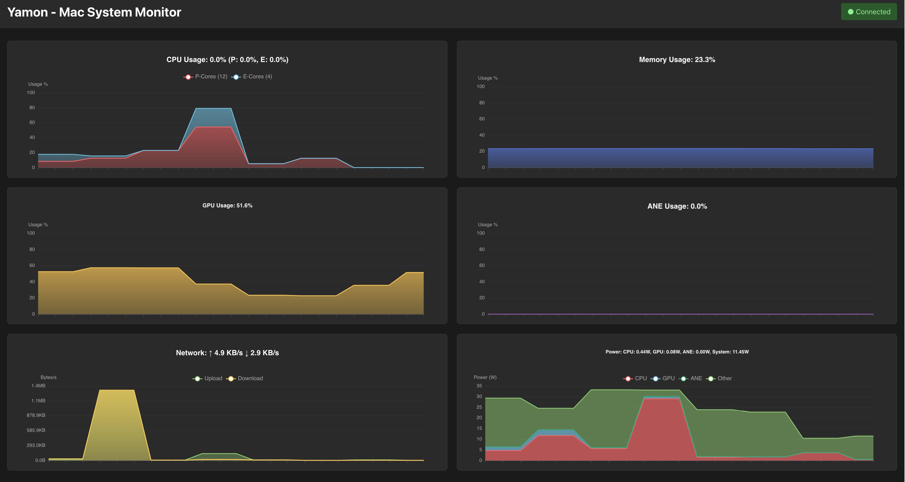

# Yamon 🍊

**Visually stunning, deep system monitoring for macOS.**

Yamon is a modern system monitor designed specifically for Apple Silicon. It goes beyond standard CPU/RAM usage to reveal the heartbeat of your Mac — from Neural Engine activity to precise power consumption — all in a beautiful, real-time web interface.



## ✨ Features

### 🚀 Deep Apple Silicon Integration
Unlock metrics that Activity Monitor hides:
- **Total System Power**: Accurate, real-time power reading (mW) directly from the SMC (just like `macmon`).
- **Power Breakdown**: See exactly how much power your CPU, GPU, and Neural Engine are sipping.
- **Neural Engine (ANE) Usage**: Track when AI models are utilizing dedicated hardware.
- **GPU Frequency & Utilization**: Granular insights into graphics performance.

### ⚡️ Real-Time & Responsive
- **Millisecond Latency**: Powered by WebSockets for an instant, lag-free experience.
- **Historical Context**: Smooth, interactive charts visualize the last 2 minutes of performance.
- **Modern UI**: Built with React and ECharts for a premium, responsive look on any device.

### 🛠️ Native Performance, Pure Python
- **Native APIs via ctypes**: Directly accesses macOS `IOReport` and `SMC` private frameworks.
- **No Dependencies**: Doesn't require compiling Rust or C/C++ binaries.
- **No Sudo Required**: Most metrics (including Power and GPU) work without root privileges.*

## 📸 Usage

### Quick Start
```bash
# 1. Clone & Setup
git clone https://github.com/grapeot/yamon.git
cd yamon

# 2. Run Backend (Collects data)
./scripts/run_backend.sh

# 3. Run Frontend (Displays data)
./scripts/run_frontend.sh
```

Visit **http://localhost:5173** to see your system in action.

## 🏗️ Architecture

Yamon bridges the gap between low-level hardware counters and high-level visualization:

1.  **Collectors (Python)**: Low-overhead bindings to Apple's private frameworks (`IOKit`, `IOReport`).
2.  **Server (FastAPI)**: Aggregates metrics and broadcasts them via efficient WebSocket streams.
3.  **Frontend (React)**: High-performance canvas rendering for dense data visualization.

## 🔋 Power Monitoring Accuracy
Yamon uses the same `mach_task_self()` iteration method as native tools to bypass macOS permission restrictions, allowing it to read the master **System Total Power (PSTR)** sensor with high precision.

---
*Note: Some deeply protected metrics may strictly require root, but Yamon is designed to degrade runs gracefully.*
