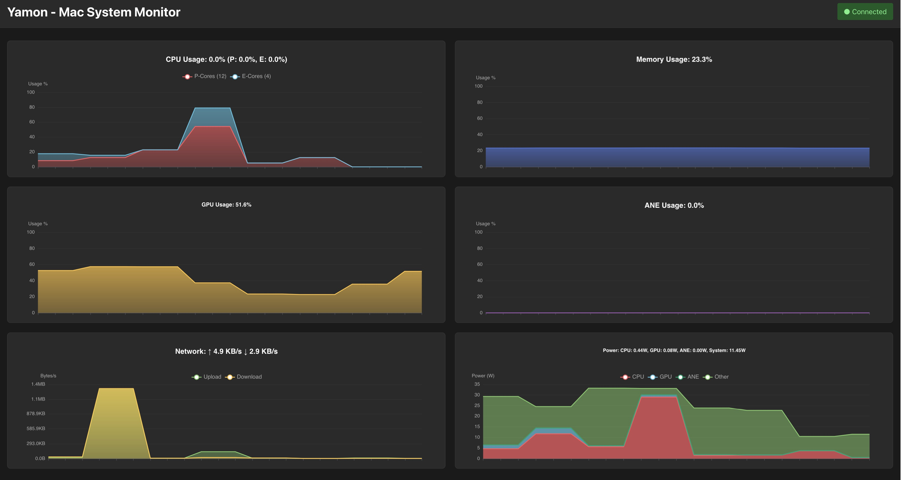

# Yamon 🍊

**Beautiful, In-Depth System Monitoring for macOS.**

Yamon is a modern system monitor engineered specifically for Apple Silicon. It goes beyond standard CPU and RAM metrics to reveal the true heartbeat of your Mac — from Neural Engine activity to precise component-level power consumption — all displayed in an elegant, real-time web interface.



## ✨ Features

### 🚀 Deep Apple Silicon Integration
Unlock metrics that standard tools often hide:
- **Total System Power**: Accurate, real-time power readings (mW) derived directly from the SMC (System Management Controller).
- **Power Breakdown**: visualize exactly how much energy your CPU, GPU, and Neural Engine are consuming.
- **Neural Engine (ANE) Usage**: Track utilization of dedicated AI hardware.
- **GPU Frequency & Usage**: Gain granular insights into graphics performance and clock speeds.

### ⚡️ Real-Time & Responsive
- **Millisecond Latency**: Powered by WebSockets for an instant, lag-free monitoring experience.
- **Historical Context**: Interactive charts visualize the last 2 minutes of performance data.
- **Modern UI**: Built with React, TypeScript, and ECharts for a premium, responsive aesthetic on any device.

### 🛠️ Native Performance, Pure Python
- **Native APIs via ctypes**: Directly interfaces with macOS `IOReport` and `SMC` private frameworks.
- **No Heavy Dependencies**: Pure Python implementation without the need for compiling Rust or C/C++ binaries.
- **No Sudo Required**: Most metrics, including granular Power and GPU stats, function without root privileges.*

## 📦 Installation

### Install from PyPI (Recommended)

The easiest way to install Yamon:

```bash
pip install yamon
```

After installation, start the monitor:

```bash
yamon
```

Visit **http://localhost:8000** to view your dashboard.

📦 **Available on PyPI**: [https://pypi.org/project/yamon/](https://pypi.org/project/yamon/)

### Install from Source

```bash
# Clone the repository
git clone https://github.com/grapeot/yamon.git
cd yamon

# Install in development mode
pip install -e .
```

## 📸 Usage

### Using the Installed Package (Recommended)

After installing from PyPI or source, simply run:

```bash
yamon
```

Or with custom options:

```bash
yamon --host 0.0.0.0 --port 8000 --reload
```

### Development Mode (From Source)

If you're developing from source:

```bash
# 1. Install in development mode
pip install -e .

# 2. Build Frontend (for production mode)
./build_frontend.sh

# 3. Run Backend
./run_backend.sh
```

Or run the installed command:

```bash
yamon --reload
```

### Development Mode (Separate Frontend & Backend)
For contributors who want to modify the frontend code.

```bash
# 1. Install in development mode
pip install -e .

# 2. Run Backend (Collects data)
./run_backend.sh

# 3. Run Frontend (Hot-reload dev server)
./run_frontend.sh
```
Visit **http://localhost:5173** for the development server.

## 🏗️ Architecture

Yamon bridges the gap between low-level hardware counters and high-level visualization:

1.  **Collectors (Python)**: Low-overhead bindings to Apple's private frameworks (`IOKit`, `IOReport`).
2.  **Server (FastAPI)**: Aggregates metrics and broadcasts them via efficient WebSocket streams.
3.  **Frontend (React)**: High-performance canvas rendering for dense data visualization.

## 📈 Multi-Day Averages

Yamon records per-minute aggregates of CPU, memory used, and system power to a
single JSONL file and shows rolling 3/7/14-day averages in the dashboard header.

- Data file: `~/Library/Application Support/yamon/summary.jsonl` (override the
  directory with the `YAMON_DATA_DIR` environment variable)
- Auto-rotate: rows older than 21 days are dropped on startup and hourly; a
  hard 20 MB cap drops the oldest rows if the file ever exceeds it
- Disk cost: one small append per minute (~150 KB/day)
- Averages only cover time while Yamon is running and the machine is awake

## 🔋 Power Monitoring Accuracy
Yamon leverages the `mach_task_self()` iteration method to interface with the hardware SMC. This allows it to read the **System Total Power (PSTR)** sensor with high precision, bypassing standard permission restrictions found in other tools.

## 📄 License

This project is licensed under the MIT License - see the [LICENSE](LICENSE) file for details.

---
*Note: While Yamon is designed to run without root, some deeply protected system metrics may unavailable without elevated privileges. The application will degrade gracefully in these cases.*
